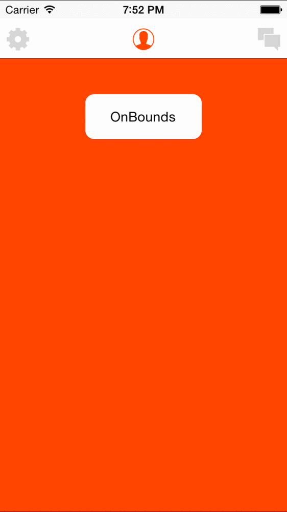

# SLPagingView

A navigation bar system allowing to do a Tinder like or Twitter like.

<div style="width:100%; height:450px;">


</div>

## Requirements

* iOS 7.0+ 
* ARC

## Installation

### CocoaPods

[CocosPods](http://cocosPods.org) is the recommended method to install SLPagingView.

Add the following line to your Podfile:

```ruby
pod 'SLPagingView'
```

And run
```ruby
pod install
```

### Manual

Import SLPagingView folder into your project.


## How to use

Easy to immplement:

```` objective-c

	// Make views for the navigation bar
    UIImage *img1 = [UIImage imageNamed:@"gear"];
    img1 = [img1 imageWithRenderingMode:UIImageRenderingModeAlwaysTemplate];
    
    UIImage *img2 = [UIImage imageNamed:@"profile"];
    img2 = [img2 imageWithRenderingMode:UIImageRenderingModeAlwaysTemplate];
    
    UIImage *img3 = [UIImage imageNamed:@"chat"];
    img3 = [img3 imageWithRenderingMode:UIImageRenderingModeAlwaysTemplate];
    
    NSArray *titles = @[[[UIImageView alloc] initWithImage:img1], [[UIImageView alloc] initWithImage:img2], [[UIImageView alloc] initWithImage:img3]];
    NSArray *views = @[[self viewWithBackground:orange], [self viewWithBackground:[UIColor yellowColor]], [self viewWithBackground:gray]];
    
    SLPagingViewController *pageViewController = [[SLPagingViewController alloc] initWithNavBarItems:titles
                                                                                    navBarBackground:[UIColor whiteColor]
                                                                                               views:views
                                                                                     showPageControl:NO];

````

Then you can make your own behaviors:

````objective-c

	// Tinder Like
    pageViewController.pagingViewMoving = ^(UIScrollView *scrollView, NSArray *subviews){
        int i = 0;
        for(UIImageView *v in subviews){
            UIColor *c = gray;
            if(v.frame.origin.x > 45
               && v.frame.origin.x < 145)
                // Left part
                c = [self gradient:v.frame.origin.x
                               top:46
                            bottom:144
                              init:orange
                              goal:gray];
            else if(v.frame.origin.x > 145
                    && v.frame.origin.x < 245)
                // Right part
                c = [self gradient:v.frame.origin.x
                               top:146
                            bottom:244
                              init:gray
                              goal:orange];
            else if(v.frame.origin.x == 145)
                c = orange;
            v.tintColor= c;
            i++;
        }
     };

````

##Other sample

Twitter like behaviors

````objective-c

	// Twitter Like
    pageViewController.pagingViewMoving = ^(UIScrollView *scrollView, NSArray *subviews){
        CGFloat xOffset = scrollView.contentOffset.x;
        int i = 0;
        for(UILabel *v in subviews){
            CGFloat alpha = 0.0;
            if(v.frame.origin.x < 145)
                alpha = 1 - (xOffset - i*320) / 320;
            else if(v.frame.origin.x >145)
                alpha=(xOffset - i*320) / 320 + 1;
            else if(v.frame.origin.x == 140)
                alpha = 1.0;
            i++;
            v.alpha = alpha;
        }
    };
````

##API

###Set current page

If you want to changed the default page control index (or whatever) you can do it calling:

````objective-c

	-(void)setCurrentIndex:(NSInteger) index;
````

###Navigation items style



You can easily customized the navigation items setting up:


````objective-c

	@property (nonatomic) SLNavigationSideItemsStyle navigationSideItemsStyle;
````


By using one of these values:


````objective-c

	typedef NS_ENUM(NSInteger, SLNavigationSideItemsStyle) {
		SLNavigationSideItemsStyleOnBounds,
		SLNavigationSideItemsStyleClose,
		SLNavigationSideItemsStyleNormal,
		SLNavigationSideItemsStyleFar,
		SLNavigationSideItemsStyleDefault,
		SLNavigationSideItemsStyleCloseToEachOne
	};
````


##License
Available under MIT license, please read LICENSE for more informations.